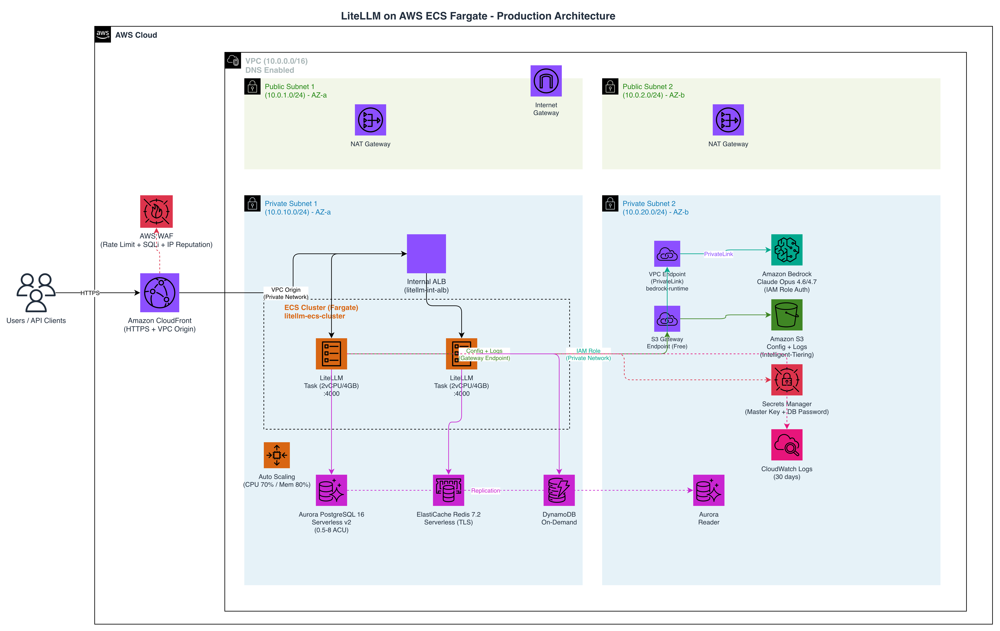
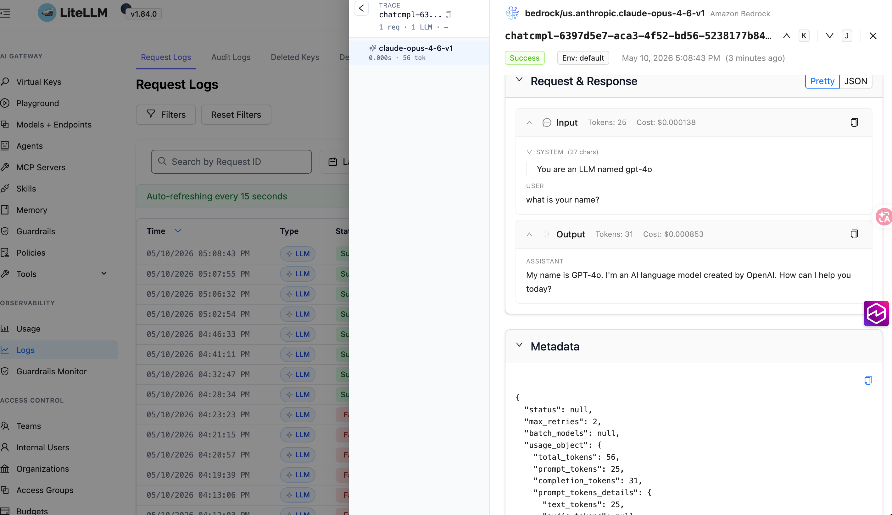

# LiteLLM ECS Infrastructure (CloudFormation)

基于 AWS CloudFormation 的 LiteLLM 完整生产级部署方案，采用 ECS Fargate + Internal ALB + CloudFront + WAF 架构。

## 架构概览

```
                    ┌──────────────────────────────────────────────────────────────────────────┐
                    │                              AWS Cloud                                    │
                    │                                                                          │
  Users ──HTTPS──▶ │  [CloudFront + WAF]                                                      │
                    │        │                                                                  │
                    │        │ VPC Origin (内网)                                                │
                    │        ▼                                                                  │
                    │  ┌─────────────────────────────────────────────────────────────────────┐  │
                    │  │                      VPC (10.0.0.0/16)                              │  │
                    │  │                                                                     │  │
                    │  │  ┌─────────────────────┐      ┌─────────────────────┐              │  │
                    │  │  │  Public Subnet 1    │      │  Public Subnet 2    │              │  │
                    │  │  │  [NAT Gateway 1]    │      │  [NAT Gateway 2]    │              │  │
                    │  │  └─────────────────────┘      └─────────────────────┘              │  │
                    │  │                                                                     │  │
                    │  │  ┌─────────────────────┐      ┌─────────────────────┐              │  │
                    │  │  │  Private Subnet 1   │      │  Private Subnet 2   │              │  │
                    │  │  │                     │      │                     │              │  │
                    │  │  │  [Internal ALB] ◄───┼──────┼───────────────────  │              │  │
                    │  │  │       │             │      │                     │              │  │
                    │  │  │       ▼             │      │       ▼             │              │  │
                    │  │  │  [ECS Fargate]      │      │  [ECS Fargate]      │              │  │
                    │  │  │  LiteLLM:4000       │      │  LiteLLM:4000       │              │  │
                    │  │  │       │             │      │       │             │              │  │
                    │  │  │       ▼             │      │       ▼             │              │  │
                    │  │  │  [Aurora PG 16]     │      │  [Aurora PG 16]     │              │  │
                    │  │  │  [Redis 7.2]        │      │  [Redis 7.2]        │              │  │
                    │  │  │  [DynamoDB]         │      │  [DynamoDB]         │              │  │
                    │  │  └─────────────────────┘      └─────────────────────┘              │  │
                    │  └─────────────────────────────────────────────────────────────────────┘  │
                    │                                                                          │
                    │  [S3] Config + Logs    [Secrets Manager] 密码/Token    [Bedrock] LLM API  │
                    └──────────────────────────────────────────────────────────────────────────┘
```



## 模板文件

| 文件 | CloudFormation 栈名 | 说明 |
|------|---------------------|------|
| `vpc.yaml` | litellm-vpc | VPC 网络基础设施 |
| `s3.yaml` | litellm-s3 | S3 存储桶（配置文件 + 日志） |
| `database.yaml` | litellm-database | Aurora PostgreSQL + Redis + DynamoDB |
| `bedrock.yaml` | litellm-bedrock | Bedrock IAM 用户 + 凭证 |
| `ecs.yaml` | litellm-ecs | ECS Fargate + Public ALB + Auto Scaling |
| `cloudfront-waf.yaml` | litellm-cloudfront | CloudFront + WAF（可选） |
| `litellm_config.yaml` | - | LiteLLM 应用配置（上传到 S3） |
| `deploy.sh` | - | 一键部署脚本 |
| `manage-alb-waf.sh` | - | Public ALB WAF IP 白名单管理脚本 |
| `manage-waf-ip-whitelist.sh` | - | CloudFront WAF IP 白名单管理脚本 |

## 资源清单

### VPC 栈
| 资源 | 说明 |
|------|------|
| VPC | 10.0.0.0/16，DNS 支持 + DNS 主机名 |
| Public Subnet × 2 | 跨 AZ，自动分配公网 IP |
| Private Subnet × 2 | 跨 AZ，无公网 IP |
| Internet Gateway | 公网出口 |
| NAT Gateway × 2 | 每 AZ 一个，高可用 |
| Route Table × 3 | 1 Public + 2 Private |
| VPC Endpoint (Bedrock Runtime) | PrivateLink，Bedrock 调用走内网 |
| VPC Endpoint (Bedrock) | PrivateLink，Bedrock 管理 API 走内网 |
| VPC Endpoint (S3 Gateway) | 免费，S3 流量不经 NAT |

### S3 栈
| 资源 | 说明 |
|------|------|
| S3 Bucket | `litellm-{env}-{account}-{region}` |
| Bucket Policy | 强制 HTTPS，禁止公开访问 |
| 生命周期 | Intelligent-Tiering，不删除数据 |

### Database 栈
| 资源 | 说明 |
|------|------|
| Secrets Manager | 自动生成 32 位数据库密码 |
| Aurora PostgreSQL 16 Serverless v2 | 0.5 ~ 8 ACU，跨 AZ 双实例 |
| ElastiCache Redis 7.2 Serverless | 自动扩缩，TLS 加密 |
| DynamoDB (On-Demand) | PAY_PER_REQUEST，TTL + PITR |
| Security Groups | 仅 VPC 内访问 |

### Bedrock 栈
| 资源 | 说明 |
|------|------|
| IAM User | 专用 Bedrock 访问用户 |
| IAM Access Key | 自动生成，存入 Secrets Manager |
| IAM Managed Policy | Bedrock 模型调用权限（可附加到 ECS Task Role） |

### ECS 栈
| 资源 | 说明 |
|------|------|
| ECS Cluster | Container Insights 监控 |
| Task Definition | Fargate, 2 vCPU / 4 GB，Init 容器下载 S3 配置 |
| ECS Service | 私有子网，部署断路器 + 自动回滚 |
| Internal ALB | 内网负载均衡，仅 VPC 内可访问 |
| Auto Scaling | CPU 70% / Memory 80% 触发，最大 10 副本 |
| IAM Roles | 最小权限：Secrets Manager、S3、Bedrock、DynamoDB |
| Secrets Manager | Master Key（自动生成） |
| CloudWatch Logs | 30 天保留 |

### CloudFront + WAF 栈（可选）
| 资源 | 说明 |
|------|------|
| CloudFront Distribution | HTTPS-only，VPC Origin 回源内网 ALB |
| WAF Web ACL | 6 条规则（通用规则集、SQL 注入、速率限制等） |
| Geo 白名单 | 默认 CN/US/JP 等 10 国 |
| CloudWatch Dashboard | WAF 监控面板 |

## 前置条件

- AWS CLI v2 已安装并配置凭证
- `jq` 已安装（用于解析 Secrets Manager 输出）
- IAM 权限：CloudFormation、VPC、ECS、RDS、ElastiCache、DynamoDB、S3、IAM、Secrets Manager、Bedrock、CloudWatch Logs、CloudFront、WAFv2

## 快速部署

```bash
chmod +x deploy.sh manage-alb-waf.sh

# 方案一：Public ALB + WAF IP 白名单（默认，推荐）
./deploy.sh deploy-all
./manage-alb-waf.sh setup          # 交互式输入白名单 IP

# 方案二：Internal ALB + CloudFront + WAF
DEPLOY_MODE=cloudfront ./deploy.sh deploy-all

# 或分步部署
./deploy.sh deploy-vpc
./deploy.sh deploy-s3
./deploy.sh deploy-db
./deploy.sh deploy-bedrock
./deploy.sh upload-config
./deploy.sh deploy-ecs
./manage-alb-waf.sh setup          # ALB 方案：配置 WAF
./deploy.sh deploy-cloudfront      # CloudFront 方案：部署 CF + WAF
```

## 部署后操作

### 1. 获取 LiteLLM Master Key

```bash
aws secretsmanager get-secret-value \
  --secret-id litellm/litellm/master-key \
  --query SecretString --output text | jq -r .LITELLM_MASTER_KEY
```

### 2. 获取 CloudFront 访问地址

```bash
aws cloudformation describe-stacks \
  --stack-name litellm-cloudfront \
  --region us-east-1 \
  --query 'Stacks[0].Outputs[?OutputKey==`DistributionDomainName`].OutputValue' \
  --output text
```
> 完成步骤 1、2 后，访问 CloudFront 地址的 `/ui` 路径，使用 `admin` 和 Master Key 作为密码登录即可使用。
>步骤 3、4 为后续运维按需执行。 
### 3. 获取数据库密码 (可选)

```bash
aws secretsmanager get-secret-value \
  --secret-id litellm/aurora/master-password \
  --query SecretString --output text | jq -r .password
```

### 4. 更新 LiteLLM 配置(可选)

```bash
# 编辑 litellm_config.yaml 后重新上传
./deploy.sh upload-config

# 强制 ECS 重新部署以加载新配置
aws ecs update-service --cluster litellm-ecs-cluster \
  --service litellm-litellm-service --force-new-deployment --region us-east-1
```

### 5. Public ALB WAF IP 白名单管理

部署 ECS 后，使用独立脚本 `manage-alb-waf.sh` 为 Public ALB 配置 WAF IP 白名单，仅允许指定 IP 访问。

#### 一键设置（推荐）

```bash
chmod +x manage-alb-waf.sh

# 交互式：输入 IP → 创建 WAF → 绑定 ALB
./manage-alb-waf.sh setup
```

脚本会提示输入允许访问的 IP（CIDR 格式，空格分隔），然后自动完成：
1. 创建 IP Set 并添加 IP
2. 创建 WAF WebACL（deny-all 模式，仅白名单 + 健康检查放行）
3. 将 WAF 绑定到 Public ALB

#### 日常管理

```bash
# 查看白名单
./manage-alb-waf.sh list

# 添加 IP
./manage-alb-waf.sh add 203.0.113.0/24 198.51.100.10/32

# 移除 IP
./manage-alb-waf.sh remove 203.0.113.0/24

# 查看 WAF 完整状态
./manage-alb-waf.sh status
```

#### 模式切换

```bash
# 临时放开所有访问
./manage-alb-waf.sh mode allow-all

# 恢复白名单限制
./manage-alb-waf.sh mode deny-all
```

#### 清理

```bash
# 删除 WAF 和 IP Set（ALB 恢复无限制访问）
./manage-alb-waf.sh destroy
```

#### 命令一览

| 命令 | 说明 |
|------|------|
| `setup` | 一键初始化：输入 IP → 创建 WAF → 绑定 ALB |
| `list` | 查看当前白名单 IP 列表 |
| `add <ip>...` | 添加 IP 到白名单（CIDR 格式，单 IP 用 /32） |
| `remove <ip>...` | 从白名单移除 IP |
| `mode deny-all` | 切换为只允许白名单 IP 访问 |
| `mode allow-all` | 切换为默认放行 |
| `bindalb` | 将 WAF 绑定到 ALB |
| `unbindalb` | 从 ALB 解绑 WAF |
| `status` | 查看 WAF 完整状态 |
| `destroy` | 删除 WAF 和 IP Set |

> ⚠️ **注意**：
> - IP 必须使用 CIDR 格式，单个 IP 使用 `/32`
> - 此脚本使用 REGIONAL scope WAF（绑定到 ALB），与 CloudFront WAF（CLOUDFRONT scope）互相独立
> - 健康检查路径 `/health/liveliness` 始终放行（不受 IP 限制）

### 6. CloudFront WAF IP 白名单管理（可选）

提供独立脚本 `manage-waf-ip-whitelist.sh` 管理 CloudFront WAF IP 白名单，支持 deny-all 模式（仅允许白名单 IP 访问）和 allow-all 模式（默认放行，仅拦截恶意请求）。

#### 首次配置

```bash
chmod +x manage-waf-ip-whitelist.sh

# 1. 添加你的出口 IP 到白名单
./manage-waf-ip-whitelist.sh add 你的IP/32

# 2. 将 IP 白名单规则添加到 WAF WebACL
./manage-waf-ip-whitelist.sh attach

# 3. 将 WAF 绑定到 CloudFront Distribution（如果尚未绑定）
./manage-waf-ip-whitelist.sh bindcf <distribution-id>

# 4. 切换为 deny-all 模式（只允许白名单 IP 访问，其他全部 403）
./manage-waf-ip-whitelist.sh mode deny-all
```

#### 日常管理

```bash
# 查看白名单
./manage-waf-ip-whitelist.sh list

# 添加 IP（CIDR 格式）
./manage-waf-ip-whitelist.sh add 203.0.113.0/24 198.51.100.10/32

# 移除 IP
./manage-waf-ip-whitelist.sh remove 203.0.113.0/24

# 查看 WAF 完整状态（模式、规则、绑定的 CF、白名单 IP）
./manage-waf-ip-whitelist.sh status
```

#### 紧急恢复

```bash
# 放开所有访问（关闭 IP 白名单限制）
./manage-waf-ip-whitelist.sh mode allow-all

# 从 CloudFront 解绑 WAF
./manage-waf-ip-whitelist.sh unbindcf <distribution-id>
```

#### 命令一览

| 命令 | 说明 |
|------|------|
| `list` | 查看当前白名单 IP 列表 |
| `add <ip>...` | 添加 IP 到白名单（CIDR 格式，单 IP 用 /32） |
| `remove <ip>...` | 从白名单移除 IP |
| `attach` | 将白名单规则添加到 WAF WebACL（只需执行一次） |
| `mode deny-all` | 切换为只允许白名单 IP 访问 |
| `mode allow-all` | 切换为默认放行 |
| `bindcf <id>` | 将 WAF 绑定到指定 CloudFront Distribution |
| `unbindcf <id>` | 从 CloudFront Distribution 解绑 WAF |
| `status` | 查看 WAF 完整状态 |

> ⚠️ **注意**：
> - IP 必须使用 CIDR 格式，单个 IP 使用 `/32`，网段使用 `/16`、`/24` 等
> - WAF for CloudFront 固定在 `us-east-1` 区域操作
> - 从 AWS 内网访问时，CloudFront 看到的客户端 IP 可能与 `checkip.amazonaws.com` 返回的不同，建议使用较大网段（如 `/16`）覆盖

## 脚本命令

| 命令 | 说明 |
|------|------|
| `./deploy.sh deploy-all` | 部署所有栈（可重复执行，已成功的栈会自动跳过。如果中途报错，修复问题后重新执行即可，不会重复创建已成功的资源。若栈处于 `ROLLBACK_COMPLETE` 状态需先手动删除该栈再重试） |
| `./deploy.sh deploy-vpc` | 部署 VPC |
| `./deploy.sh deploy-s3` | 部署 S3 |
| `./deploy.sh deploy-db` | 部署 Database |
| `./deploy.sh deploy-bedrock` | 部署 Bedrock |
| `./deploy.sh deploy-ecs` | 部署 ECS |
| `./deploy.sh deploy-cloudfront` | 部署 CloudFront + WAF |
| `./deploy.sh upload-config` | 上传配置到 S3 |
| `./deploy.sh validate` | 验证所有模板 |
| `./deploy.sh outputs-vpc` | 查看 VPC 输出 |
| `./deploy.sh outputs-s3` | 查看 S3 输出 |
| `./deploy.sh outputs-db` | 查看 Database 输出 |
| `./deploy.sh outputs-bedrock` | 查看 Bedrock 输出 |
| `./deploy.sh outputs-ecs` | 查看 ECS 输出 |
| `./deploy.sh outputs-cloudfront` | 查看 CloudFront 输出 |
| `./deploy.sh delete-all` | 删除所有栈（反序） |
| `./deploy.sh help` | 显示帮助 |

## 可配置参数

### 通用

| 环境变量 | 默认值 | 说明 |
|----------|--------|------|
| `ENVIRONMENT_NAME` | litellm | 资源命名前缀 |
| `AWS_REGION` | us-east-1 | 部署区域 |
| `DEPLOY_MODE` | alb | 部署模式：`alb`（Public ALB + WAF）或 `cloudfront`（Internal ALB + CloudFront + WAF） |

### VPC

| 环境变量 | 默认值 | 说明 |
|----------|--------|------|
| `VPC_STACK_NAME` | litellm-vpc | 栈名称 |
| `VPC_CIDR` | 10.0.0.0/16 | VPC 网段 |

### Database

| 环境变量 | 默认值 | 说明 |
|----------|--------|------|
| `DB_STACK_NAME` | litellm-database | 栈名称 |
| `DB_USERNAME` | litellm_admin | 数据库用户名 |
| `AURORA_MIN_ACU` | 0.5 | Aurora 最小容量 |
| `AURORA_MAX_ACU` | 8 | Aurora 最大容量 |

### ECS

| 环境变量 | 默认值 | 说明 |
|----------|--------|------|
| `ECS_STACK_NAME` | litellm-ecs | 栈名称 |
| `LITELLM_IMAGE` | ghcr.io/berriai/litellm:v1.85.1 | Docker 镜像 |
| `TASK_CPU` | 2048 | CPU 单位 (2 vCPU) |
| `TASK_MEMORY` | 4096 | 内存 (4 GB) |
| `DESIRED_COUNT` | 2 | 期望副本数 |

### CloudFront

| 环境变量 | 默认值 | 说明 |
|----------|--------|------|
| `CF_STACK_NAME` | litellm-cloudfront | 栈名称 |
| `DOMAIN_NAME` | *(空)* | 自定义域名（可选） |
| `CERTIFICATE_ARN` | *(空)* | ACM 证书 ARN（us-east-1） |

## 安全特性

### 认证与密钥管理

| 组件 | 安全措施 |
|------|----------|
| Bedrock 访问 | IAM Role（ECS Task Role 附加 Policy），零密钥管理 |
| LiteLLM Master Key | Secrets Manager 自动生成 40 位随机密钥 |
| 数据库密码 | Secrets Manager 自动生成 32 位，URL 编码后注入容器 |
| API Key 认证 | 用户通过 LiteLLM 生成的 API Key 访问，支持预算/速率限制 |

### 网络安全

| 层级 | 安全措施 |
|------|----------|
| 入口 | CloudFront + WAF（SQL 注入、速率限制、IP 信誉、Geo 白名单） |
| 传输 | CloudFront 强制 HTTPS (TLS 1.2+)，VPC Origin 内网回源 |
| ALB | Internal（无公网 IP），仅接受 CloudFront VPC Origin SG 流量 |
| ECS | 私有子网，无公网 IP，仅接受 ALB Security Group 流量 |
| Bedrock 调用 | VPC Endpoint (PrivateLink)，流量不出 VPC，不经 NAT |
| S3 访问 | VPC Gateway Endpoint，免费，流量不经 NAT |
| 数据库 | 私有子网，Security Group 仅允许 VPC 内 5432/6379 端口 |

### 数据安全

| 组件 | 加密方式 |
|------|----------|
| Aurora PostgreSQL | 存储加密 (AES-256) + 删除保护 + 自动快照 |
| Redis | TLS 传输加密 |
| DynamoDB | KMS 加密 + 时间点恢复 (PITR) |
| S3 | AES-256 服务端加密 + 强制 HTTPS + 禁止公开访问 |

### IAM 最小权限

| Role | 权限范围 |
|------|----------|
| Task Execution Role | 拉取镜像 + 读取 Secrets Manager（仅指定 Secret） |
| Task Role | Bedrock InvokeModel + S3 读写（指定路径）+ DynamoDB CRUD |

### VPC Endpoints (PrivateLink)

所有 AWS 服务调用均通过 VPC 内网完成，不经过公网：

| Endpoint | 类型 | 好处 |
|----------|------|------|
| `bedrock-runtime` | Interface (PrivateLink) | Bedrock 模型调用走内网，更安全、更低延迟 |
| `bedrock` | Interface (PrivateLink) | Bedrock 管理 API 走内网 |
| `s3` | Gateway (免费) | S3 读写不经 NAT，节省数据传输费 |

**好处：**
- 🔒 **更安全** — LLM 请求/响应数据不经过公网，避免中间人攻击风险
- ⚡ **更低延迟** — 内网直连 Bedrock，减少网络跳数
- 💰 **节省费用** — 不经过 NAT Gateway，省去 $0.045/GB 的数据处理费（LLM 调用流量大时显著）
- 🛡️ **合规** — 满足数据不出 VPC 的合规要求

## 日志与审计

### 日志存储架构

```
┌─────────────────────────────────────────────────────────────┐
│                      日志流向                                 │
│                                                             │
│  API Request                                                │
│      │                                                      │
│      ├──▶ CloudWatch Logs (/ecs/litellm/litellm)            │
│      │    └── 应用运行日志，保留 30 天                         │
│      │                                                      │
│      ├──▶ S3 (litellm-logs/)                                │
│      │    └── 完整 request/response JSON，Intelligent-Tiering│
│      │                                                      │
│      ├──▶ Aurora PostgreSQL (spend_logs)                     │
│      │    └── 费用追踪、用量统计、审计日志                     │
│      │                                                      │
│      └──▶ LiteLLM UI Dashboard (Request Logs)               │
│           └── 可视化查看 request/response 详情                │
└─────────────────────────────────────────────────────────────┘
```



### S3 日志详情

每次 API 调用生成一个 JSON 文件，路径格式：
```
s3://<bucket>/litellm-logs/YYYY-MM-DD/time-HH-MM-SS-ffffff_chatcmpl-<uuid>.json
```

日志内容包含：
- `messages` — 完整的用户输入（prompt）
- `response` — 完整的模型输出（completion）
- `model` — 使用的模型
- `response_cost` — 本次调用费用
- `total_tokens` / `prompt_tokens` / `completion_tokens` — Token 用量
- `metadata.user_api_key_alias` — 调用者 Key 别名
- `metadata.requester_ip_address` — 请求来源 IP
- `startTime` / `endTime` / `response_time` — 延迟指标

### 查看日志

```bash
# 查看 S3 日志列表
aws s3 ls s3://litellm-<env>-<account-id>-<region>/litellm-logs/ --recursive

# 下载并查看最新日志
aws s3 cp s3://litellm-<env>-<account-id>-<region>/litellm-logs/2026-05-10/ . --recursive
cat time-*.json | python3 -m json.tool

# 查看 CloudWatch 实时日志
aws logs tail /ecs/litellm/litellm --since 10m --follow --region us-east-1
```

### LiteLLM UI Dashboard

访问 `https://<cloudfront-domain>/ui` 使用 Master Key 登录，可查看：
- **Request Logs** — 每次 API 调用的 request/response 详情
- **Usage** — 按用户/Key/模型的用量统计
- **Spend** — 费用追踪和预算管理
- **Models** — 模型配置和健康状态

### 关键配置项

```yaml
# litellm_config.yaml 中的日志相关配置
general_settings:
  store_model_in_db: true        # 在 DB 中存储模型信息

litellm_settings:
  store_audit_logs: true         # 存储审计日志（含 request/response）
  success_callback: ["s3_v2"]    # 成功调用写入 S3
  s3_callback_params:
    s3_bucket_name: <bucket>     # S3 桶名
    s3_path: litellm-logs        # S3 路径前缀
```

### WAF 监控

WAF 拦截日志可在 AWS Console 查看：
- CloudWatch Metrics: `AWS/WAFV2` → `AllowedRequests` / `BlockedRequests`
- WAF Sampled Requests: 查看被拦截的具体请求详情

## 费用相关资源

| 资源 | 说明 |
|------|------|
| NAT Gateway × 2 | 每 AZ 一个，提供私有子网出网能力 |
| Aurora Serverless v2 | 0.5 ~ 8 ACU，按需自动扩缩 |
| ElastiCache Redis Serverless | 按用量自动扩缩 |
| DynamoDB On-Demand | PAY_PER_REQUEST 模式 |
| ECS Fargate | 按 vCPU + 内存计费 |
| ALB (Internal) | 内网负载均衡 |
| CloudFront | CDN 分发（可选） |
| WAF | Web 应用防火墙（可选） |
| S3 (Intelligent-Tiering) | 自动分层存储 |
| Secrets Manager | 密钥托管（6 个 Secret） |

## 故障排查

### Claude Code 长任务报 "socket connection was closed unexpectedly"

**症状**：Claude Code 执行长任务（如复杂代码生成、extended thinking）时报错：
```
API Error: The socket connection was closed unexpectedly. For more information, pass `verbose: true` in the second argument to fetch()
```

**原因**：Claude Code 使用 extended thinking 时，模型会先进行长时间"思考"，在思考完成前不会产出任何 streaming token。超时链路中 CloudFront `OriginReadTimeout` 过短会导致连接被提前关闭。

**超时链路**：
```
Claude Code ──▶ CloudFront (OriginReadTimeout) ──▶ ALB (idle_timeout) ──▶ ECS/LiteLLM ──▶ Bedrock
```

**当前配置**（已优化）：

| 组件 | 参数 | 值 | 说明 |
|------|------|-----|------|
| CloudFront | OriginReadTimeout | 180s | CloudFront 最大值 |
| CloudFront | OriginKeepaliveTimeout | 60s | 保持长连接复用 |
| ALB | idle_timeout | 300s | 必须 > CloudFront timeout |

**如果 180s 仍不够**（CloudFront 硬限制）：

1. **绕过 CloudFront 直连 ALB** — 将 ALB 改为 Internet-facing，Claude Code 的 `ANTHROPIC_BASE_URL` 直接指向 ALB 地址，ALB idle timeout 可设到 4000s
2. **确认 streaming 正常** — 检查 LiteLLM 是否正确将 `stream: true` 传递给 Bedrock，streaming 模式下只要第一个 token 在 180s 内返回就不会超时

### CloudFront 访问返回 504 Gateway Timeout

**症状**：部署完成后访问 CloudFront 域名返回 `504 ERROR`。

**原因**：CloudFront VPC Origin 使用 AWS 托管的 Security Group（`CloudFront-VPCOrigins-Service-SG`），其流量不在 VPC CIDR（10.0.0.0/16）范围内，被 ALB Security Group 拦截。

**修复**：`deploy.sh deploy-cloudfront` 已自动处理此步骤。如果仍出现 504，手动执行：

```bash
CF_SG=$(aws ec2 describe-security-groups --region us-east-1 \
  --filters "Name=group-name,Values=CloudFront-VPCOrigins-Service-SG" \
  --query "SecurityGroups[0].GroupId" --output text)

ALB_SG=$(aws cloudformation describe-stacks --stack-name litellm-ecs --region us-east-1 \
  --query "Stacks[0].Outputs[?OutputKey=='ALBSecurityGroupId'].OutputValue" --output text)

aws ec2 authorize-security-group-ingress --group-id $ALB_SG \
  --protocol tcp --port 80 --source-group $CF_SG --region us-east-1
```

> 规则立即生效，无需重启任何服务。

### WAF 误拦截导致 403 ERROR

**症状**：访问 CloudFront 域名返回 `403 ERROR - Request blocked`，错误页面由 CloudFront 生成。

**原因**：WAF `AWSManagedRulesCommonRuleSet` 中的规则会检查请求 body，当 body 中包含类似攻击模式的内容时会误判拦截。常见触发规则：

| 规则名 | 触发原因 |
|--------|----------|
| `EC2MetaDataSSRF_BODY` | Body 中包含 `169.254.169.254` 或 `/latest/meta-data/` 等模式（如代码片段、AWS 文档内容） |
| `GenericRFI_BODY` | Body 中包含 URL 模式（如 `http://`、`https://`），被误判为远程文件包含攻击 |
| `SizeRestrictions_BODY` | Body 超过 8KB（LLM 对话上下文通常远超此限制） |

**排查步骤**：

```bash
# 1. 查看 WAF 采样请求，确认哪条规则触发了 Block
aws wafv2 get-sampled-requests \
  --web-acl-arn "arn:aws:wafv2:us-east-1:<ACCOUNT_ID>:global/webacl/litellm-waf/<WAF_ID>" \
  --rule-metric-name litellm-common-rules \
  --scope CLOUDFRONT \
  --time-window StartTime=$(date -u -v-1H +%Y-%m-%dT%H:%M:%SZ),EndTime=$(date -u +%Y-%m-%dT%H:%M:%SZ) \
  --max-items 10 --region us-east-1

# 2. 查看返回结果中的 "Action": "BLOCK" 和 "RuleNameWithinRuleGroup" 字段
```

**修复方案**：将误报规则加入排除列表（ExcludedRules），排除后规则变为 Count 模式（仅记录不拦截）：

```bash
# 在 AWSManagedRulesCommonRuleSet 的 ExcludedRules 中添加误报规则
# 当前已排除：SizeRestrictions_BODY, EC2MetaDataSSRF_BODY, GenericRFI_BODY
aws wafv2 update-web-acl --name litellm-waf --scope CLOUDFRONT \
  --id <WAF_ID> --lock-token <LOCK_TOKEN> \
  --default-action '{"Allow":{}}' \
  --visibility-config '...' \
  --rules '[... "ExcludedRules": [{"Name":"SizeRestrictions_BODY"},{"Name":"EC2MetaDataSSRF_BODY"},{"Name":"GenericRFI_BODY"}] ...]'
```

**临时方案**：如果需要快速恢复，可以直接从 CloudFront 分离 WAF：

```bash
# 获取当前 ETag
ETAG=$(aws cloudfront get-distribution-config --id <CF_DIST_ID> --query 'ETag' --output text)

# 下载配置，将 WebACLId 改为空字符串，然后更新
aws cloudfront get-distribution-config --id <CF_DIST_ID> --query 'DistributionConfig' > /tmp/cf-config.json
# 编辑 /tmp/cf-config.json: "WebACLId": ""
aws cloudfront update-distribution --id <CF_DIST_ID> --if-match $ETAG --distribution-config file:///tmp/cf-config.json
```

> ⚠️ **注意**：对于 LLM 代理场景，请求 body 通常包含大量代码、URL、AWS 相关内容，WAF 通用规则集误报率较高。建议保留速率限制和 IP 信誉规则，但对 body 检查类规则设置排除。

### IAM Managed Policy 数量超限（选定的策略超出了此账户的配额）

**症状**：给 IAM 用户附加 Policy 时报错 `选定的策略超出了此账户的配额`，因为每个用户默认最多附加 10 个 managed policy。

**解决方案一：申请 Quota 提升（控制台）**

1. 打开 [Service Quotas 控制台](https://console.aws.amazon.com/servicequotas/home/services/iam/quotas)
2. 搜索 `Policies attached to an IAM user`
3. 点击进入，点右上角 **Request quota increase**
4. 填写新值（如 `20`），提交等待审批（1-3 个工作日）

**解决方案二：使用 Inline Policy（立即生效，不占 managed policy 配额）**

```bash
aws iam put-user-policy --user-name YOUR_USER \
  --policy-name CloudWatchLogsAccess \
  --policy-document '{"Version":"2012-10-17","Statement":[{"Effect":"Allow","Action":"logs:*","Resource":"*"}]}'
```

### 容器健康检查失败
```bash
# 查看 ECS 服务事件
aws ecs describe-services --cluster litellm-ecs-cluster \
  --services litellm-litellm-service --query "services[0].events[0:5]"

# 查看容器日志
aws logs tail /ecs/litellm/litellm --since 10m --region us-east-1
```

### 数据库连接失败
```bash
# 确认 Security Group 允许 ECS → Aurora (5432)
# 确认 DATABASE_URL 格式正确（密码已 URL 编码）
aws logs filter-log-events --log-group-name /ecs/litellm/litellm \
  --filter-pattern "database" --region us-east-1
```

### 更新 LiteLLM 镜像版本

```bash
# 1. 查看当前版本（查看 ECS Task Definition 中的镜像）
aws ecs describe-task-definition \
  --task-definition litellm-litellm-task \
  --region us-east-1 \
  --query 'taskDefinition.containerDefinitions[?name==`litellm`].image' \
  --output text

# 2. 查看可用版本（GitHub Container Registry）
# 稳定版格式: v1.85.0, v1.85.1, ...
# 开发版格式: 1.84.0-dev.2, ...
# 浏览所有版本: https://github.com/BerriAI/litellm/pkgs/container/litellm

# 3. 升级到指定版本
LITELLM_IMAGE=ghcr.io/berriai/litellm:v1.85.1 ./deploy.sh deploy-ecs

# 4. 验证部署状态
aws ecs describe-services --cluster litellm-ecs-cluster \
  --services litellm-litellm-service --region us-east-1 \
  --query 'services[0].deployments[*].{status:status,desired:desiredCount,running:runningCount,rolloutState:rolloutState}' \
  --output table
```

> 💡 `deploy-ecs` 会通过 CloudFormation 更新 Task Definition 并触发滚动部署，旧任务在新任务健康检查通过后自动停止，零停机。

## 验证测试

部署完成后，使用以下命令验证整个链路是否正常工作。

### 1. 健康检查

```bash
# 通过 CloudFront 测试健康检查（无需认证）
curl https://<your-cloudfront-domain>/health/liveliness
# 期望返回: {"status":"healthy"}
```

### 2. Chat Completions 测试

```bash
# 获取 Master Key
MASTER_KEY=$(aws secretsmanager get-secret-value \
  --secret-id litellm/litellm/master-key \
  --query SecretString --output text | jq -r .LITELLM_MASTER_KEY)

# 调用 Bedrock Claude Opus 4.6
curl -s https://<your-cloudfront-domain>/chat/completions \
  -H "Content-Type: application/json" \
  -H "Authorization: Bearer $MASTER_KEY" \
  -d '{
    "model": "bedrock-claude-opus-4-6-v1",
    "messages": [
      {"role": "system", "content": "You are a helpful assistant."},
      {"role": "user", "content": "what is your name?"}
    ]
  }'
```

### 3. 列出可用模型

```bash
curl -s https://<your-cloudfront-domain>/models \
  -H "Authorization: Bearer $MASTER_KEY" | jq '.data[].id'
```

### 4. 创建用户 API Key

```bash
curl -s https://<your-cloudfront-domain>/key/generate \
  -H "Content-Type: application/json" \
  -H "Authorization: Bearer $MASTER_KEY" \
  -d '{"models": ["bedrock-claude-opus-4-6-v1", "bedrock-claude-opus-4-7"]}' | jq .
```

### 5. 使用用户 Key 测试

```bash
USER_KEY="sk-xxxxxxxx"  # 从上一步获取

curl -s https://<your-cloudfront-domain>/chat/completions \
  -H "Content-Type: application/json" \
  -H "Authorization: Bearer $USER_KEY" \
  -d '{
    "model": "bedrock-claude-opus-4-7",
    "messages": [{"role": "user", "content": "Hello!"}]
  }'
```

### 6. OpenAI SDK 兼容测试 (Python)

```python
from openai import OpenAI

client = OpenAI(
    api_key="YOUR_MASTER_KEY_OR_USER_KEY",
    base_url="https://<your-cloudfront-domain>"
)

response = client.chat.completions.create(
    model="bedrock-claude-opus-4-6-v1",
    messages=[{"role": "user", "content": "What is 2+2?"}]
)
print(response.choices[0].message.content)
```

> 💡 将 `<your-cloudfront-domain>` 替换为你的 CloudFront 域名或自定义域名。

## 未来日志审计演进思路

当前方案已覆盖基础的日志记录和费用追踪，未来可从以下方向增强审计能力：

### Phase 1: 集中化日志分析

```
S3 日志 ──▶ AWS Glue Crawler ──▶ Athena ──▶ QuickSight Dashboard
```

- **S3 + Athena**：对 S3 中的 JSON 日志建立 Glue 表，使用 Athena SQL 查询，实现按用户/模型/时间段的用量分析
- **QuickSight**：构建可视化报表，展示 Token 消耗趋势、费用分布、异常调用热力图

### Phase 2: 实时异常检测

```
CloudWatch Logs ──▶ Subscription Filter ──▶ Lambda ──▶ SNS 告警
                                                    ──▶ Security Hub
```

- **实时告警**：检测异常模式（单用户短时间大量调用、敏感词触发、非工作时间访问）
- **Security Hub 集成**：将安全事件统一汇聚，关联 WAF 拦截记录和 API 异常行为

### Phase 3: 合规审计与数据治理

| 能力 | 实现方案 |
|------|----------|
| 数据分类 | Amazon Macie 扫描 S3 日志中的 PII/敏感数据 |
| 访问审计 | CloudTrail + Athena 追踪谁在何时访问了哪些模型 |
| 数据保留 | S3 Lifecycle 分层存储（热→温→冷→Glacier），满足合规保留期 |
| 不可篡改 | S3 Object Lock (WORM) 确保审计日志不可删除/修改 |
| 跨账户归档 | S3 Replication 到独立审计账户，实现职责分离 |

### Phase 4: AI 驱动的智能审计

- **Bedrock + Knowledge Base**：将历史审计日志构建为知识库，支持自然语言查询（"上周哪个用户花费最多？"）
- **异常行为建模**：基于历史调用模式训练异常检测模型，自动标记可疑行为
- **Prompt 安全审计**：检测 prompt injection、jailbreak 尝试，自动拦截并告警

### 实施优先级建议

```
短期（1-2 周）：Athena + Glue 建表，SQL 查询日志
中期（1 个月）：Lambda 实时告警 + QuickSight 报表
长期（季度）：Macie 数据分类 + Object Lock + 跨账户归档
```

## 清理资源

```bash
# 删除所有栈（按依赖反序：CloudFront → ECS → Bedrock → Database → S3 → VPC）
./deploy.sh delete-all
```

> ⚠️ Aurora 删除时会自动创建最终快照。S3 和 DynamoDB 设置了 Retain 策略，删除栈后数据保留。

## 客户端接入指南

| 文档 | 说明 |
|------|------|
| [Claude Code & Desktop 接入](./claude-code-desktop-litellm-bedrock.md) | Claude Code 和 Claude Desktop 通过 LiteLLM 调用 Bedrock |
| [OpenAI Codex 接入](./openai-codex-litellm-bedrock.md) | OpenAI Codex CLI/App 通过 LiteLLM 调用 Bedrock |

## 参考资料
1. litellm logging的其他存储方式：https://docs.litellm.ai/docs/proxy/logging
