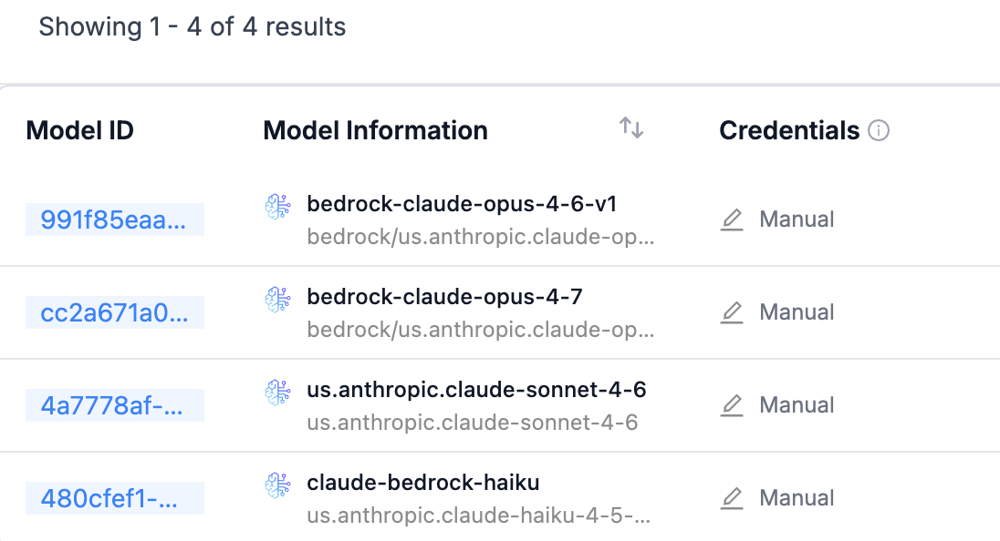
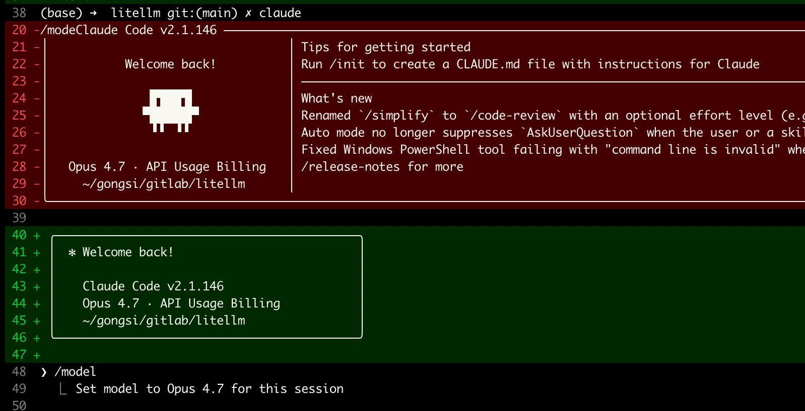
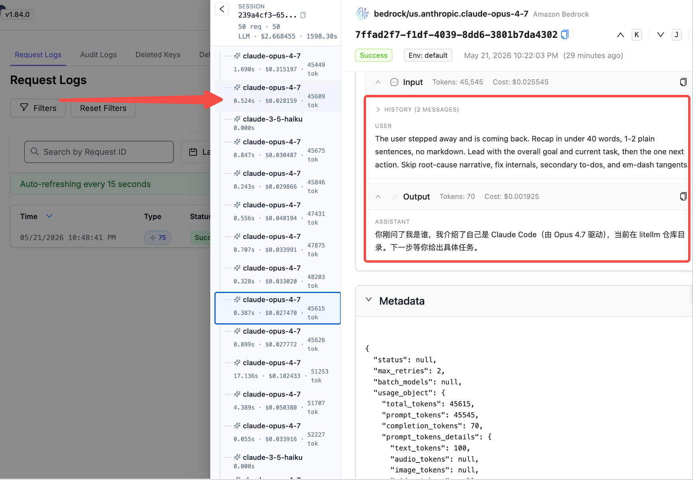
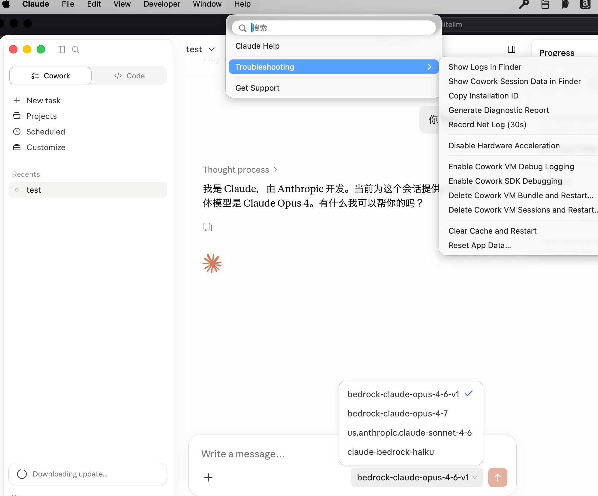

# Claude Code 与 Claude Desktop 接入 LiteLLM 实战

通过 LiteLLM 代理，Claude Code 和 Claude Desktop 可以直接调用 AWS Bedrock 上的 Claude 模型，即可使用 Code、CoWork 等完整能力。

---

## 前置：用 curl 验证 LiteLLM 通路

在配置 Claude Code / Desktop 前，建议先用 `curl` 直接调用 LiteLLM 的 `/v1/messages` 端点（Anthropic 兼容格式），确认代理、Virtual Key、Bedrock 模型链路全部可用：

```bash
curl https://litellm-ui.<your-domain>.com/v1/messages \
  -H "x-api-key: sk-****" \
  -H "anthropic-version: 2023-06-01" \
  -H "content-type: application/json" \
  -d '{
    "model": "us.anthropic.claude-sonnet-4-6",
    "max_tokens": 1024,
    "messages": [
      {"role": "user", "content": "你好，请用一句话自我介绍"}
    ]
  }'
```

正常情况下会返回类似如下的响应：

```json
{
  "id": "msg_...",
  "type": "message",
  "role": "assistant",
  "model": "us.anthropic.claude-sonnet-4-6",
  "content": [
    {"type": "text", "text": "你好，我是 Claude……"}
  ],
  "stop_reason": "end_turn",
  "usage": { "input_tokens": 18, "output_tokens": 24 }
}
```

如果返回 `401 / 403`，检查 `x-api-key` 是否为 LiteLLM 上有效的 Virtual Key；如果返回 `404 model not found`，检查 `model` 名称是否与 LiteLLM `model_list` 中的 `model_name` 完全一致。

---

## 一、Claude Code 接入 LiteLLM

### 1. 在 LiteLLM 中添加 Bedrock 模型

在 LiteLLM UI 中配置好 Bedrock 上的 Claude 模型（Opus / Sonnet / Haiku 等）：



### 2. 配置环境变量

在终端或 `~/.zshrc` / `~/.bashrc` 中添加以下环境变量：

```bash
export ANTHROPIC_BASE_URL=https://litellm-ui.<your-domain>.com
export ANTHROPIC_AUTH_TOKEN=sk-****
export ANTHROPIC_DEFAULT_OPUS_MODEL=bedrock-claude-opus-4-7
export ANTHROPIC_DEFAULT_SONNET_MODEL=us.anthropic.claude-sonnet-4-6
export ANTHROPIC_DEFAULT_HAIKU_MODEL=claude-bedrock-haiku
```

| 变量 | 说明 |
|------|------|
| `ANTHROPIC_BASE_URL` | LiteLLM 代理地址 |
| `ANTHROPIC_AUTH_TOKEN` | LiteLLM 上签发的 Virtual Key |
| `ANTHROPIC_DEFAULT_*_MODEL` | Claude Code 在不同档位下默认调用的模型名 |

### 3. 启动并验证

直接在命令行执行 `claude` 即可进入交互界面：

```text
(base) ➜  litellm git:(main) ✗ claude

 ╭───────────────────────────────────────────╮
 │  ✻ Welcome back!                          │
 │                                           │
 │    Claude Code v2.1.146                   │
 │    Opus 4.7 · API Usage Billing           │
 │    ~/gongsi/gitlab/litellm                │
 ╰───────────────────────────────────────────╯

❯ /model
  ⎿  Set model to Opus 4.7 for this session

❯ 你是谁？

⏺ 我是 Claude Code，Anthropic 官方的命令行工具，
  由 Claude Opus 4.7 模型驱动 ……
```

看到模型正常响应，即说明 Claude Code 已通过 LiteLLM 成功调用 Bedrock 上的 Claude 模型。

实际调用截图（Claude Code 通过 LiteLLM 走 Bedrock 链路）：



#### LiteLLM 全链路日志追踪

通过 LiteLLM 的请求日志，可以清晰地看到 Claude Code 每一次调用的完整过程 —— 包括请求参数、模型路由、tool use、token 用量、耗时等，对**学习和分析 Claude Code 的工作机制非常有帮助**：



借助这些日志，可以观察到：

- Claude Code 在不同任务中如何切换 Opus / Sonnet / Haiku 档位
- 每次请求中携带的 system prompt、tool 定义、上下文长度
- Agentic loop 里多轮 tool call 的拆分与回填
- 真实的 input / output token 消耗，便于成本分析与优化

---

## 二、Claude Desktop 接入 LiteLLM

通过 LiteLLM 代理，Claude Desktop 可直接连接企业内部的 Bedrock 模型，无需额外账号即可使用 Code 与 CoWork 能力。

### 1. 开启 Claude Desktop 的 Debug 模式

在 Claude Desktop 中开启 Debug / Developer 模式，使其支持自定义 endpoint：



### 2. 在桌面端选择 LiteLLM 上的模型

开启 Debug 模式后，Claude Desktop 会通过 LiteLLM 连接到所有已注册的模型，可在下拉框中直接切换：


---

## 小结

### 为什么通过 LiteLLM 而不是直连 Bedrock？

| 能力 | 直连 Bedrock | 通过 LiteLLM |
|------|-------------|-------------|
| 预算控制 | 无，需额外方案 | 内置按用户/团队/Key 实时限额 |
| 多模型切换 | 需改代码 | 统一 API，UI 切换模型 |
| 审计追踪 | CloudTrail 粒度粗 | 请求级日志，含 Prompt/Response |
| Key 管理 | IAM 长期凭证 | Virtual Key 可随时撤销、设过期 |
| 速率限制 | 仅 Bedrock 服务端限流 | 按 Key/用户自定义 RPM/TPM |

### 方案对比

| 方案 | 适用场景 | 是否需要额外账号 |
|------|---------|-----------------|
| Claude Code + LiteLLM | 终端命令行开发 | 否，使用企业 LiteLLM Key |
| Claude Desktop + LiteLLM | 桌面端 Code / CoWork | 否，使用企业 LiteLLM Key |

通过 LiteLLM 统一代理 Bedrock 上的 Claude 模型，开发者使用 Anthropic 官方客户端的完整能力，同时企业获得成本可控、访问可审计、Key 可管理的治理能力。
