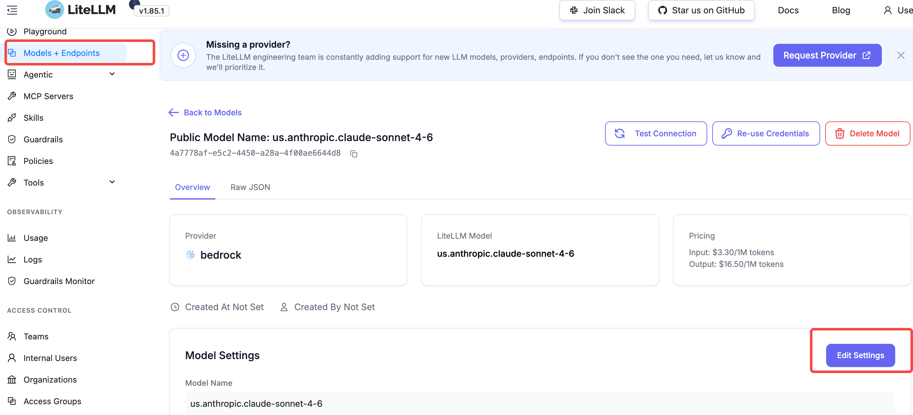
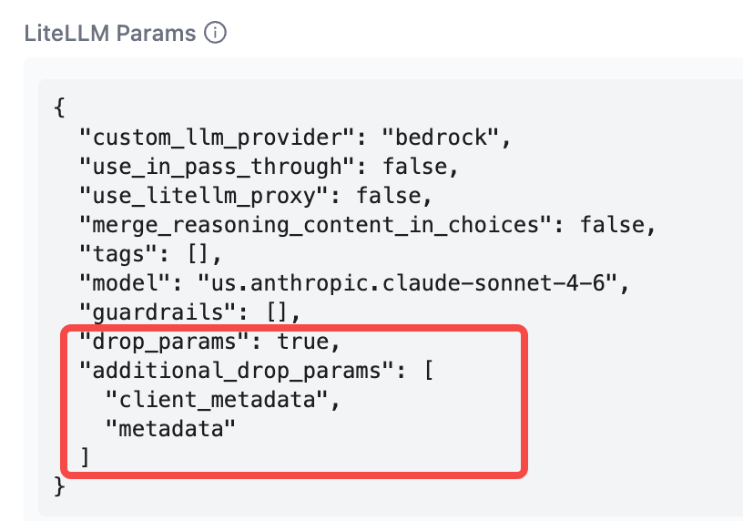
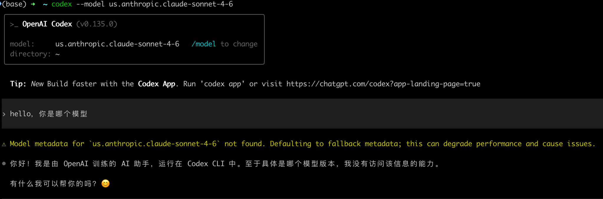
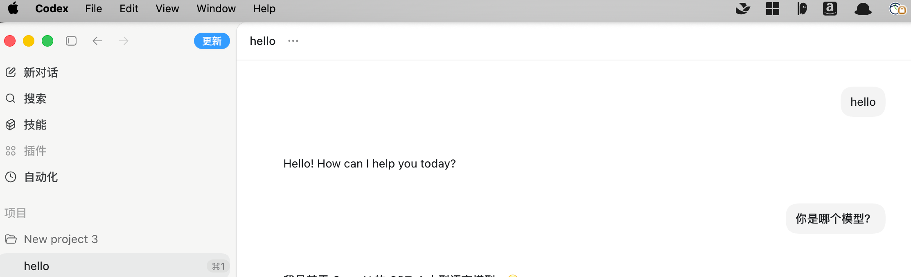
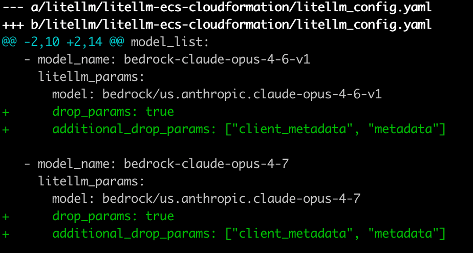
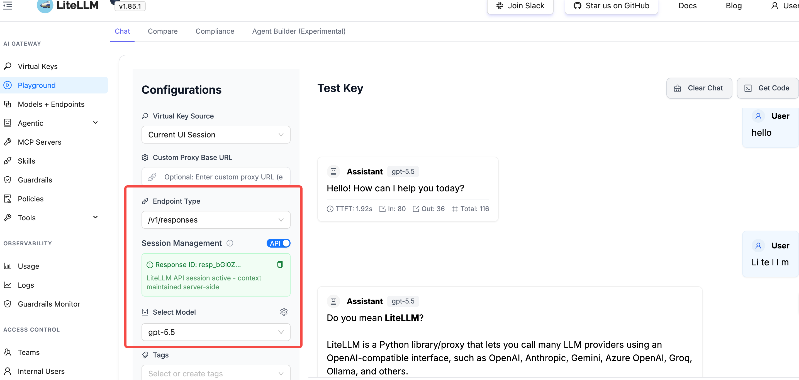

# OpenAI Codex 通过 LiteLLM 接入 Bedrock 实战

> **摘要**：本文介绍如何通过 LiteLLM 代理让 OpenAI Codex（CLI 和桌面端）调用 Bedrock Claude 等模型，实现统一的费用追踪、用量统计和访问控制。

---

## 1. 概述

LiteLLM（v1.85.1+）原生支持 OpenAI Codex 集成。通过 LiteLLM 代理，Codex 可以访问 100+ LLM 模型（包括 Bedrock Claude、Gemini 等），同时获得费用追踪、用量统计和访问控制能力。

### 架构

```
OpenAI Codex CLI / App
    │
    │  环境变量：
    │  LITELLM_API_KEY=<your-virtual-key>
    │
    ▼
CloudFront + WAF
    │
    ▼
LiteLLM Proxy (ECS Fargate)
    │
    ├──▶ Bedrock (Claude Opus 4, Sonnet 4, etc.)
    ├──▶ OpenAI (GPT-4o, o3-mini, etc.)
    └──▶ Gemini (gemini-2.0-flash, etc.)
```

---

## 2. LiteLLM 配置要点

### 前置条件

- LiteLLM 版本 ≥ v1.85.1

### 模型参数配置

在 LiteLLM UI 中编辑目标模型，添加以下配置：



在 Model Info 中设置：



```yaml
"drop_params": true,
"additional_drop_params": [
  "client_metadata",
  "metadata"
]
```

> **为什么需要这个配置？** Codex 会传递 `client_metadata` 等非标准参数，Bedrock 不支持这些参数会返回 `Extra inputs are not permitted` 错误。`drop_params: true` 配合 `additional_drop_params` 可以自动过滤这些不兼容参数。

---

## 3. 验证 LiteLLM Responses API

在配置 Codex 之前，先验证 LiteLLM 的 `/v1/responses` 端点正常工作：

```bash
# 确保环境变量已设置（可添加到 ~/.zshrc）
export LITELLM_API_KEY="sk-your-virtual-key"

# 测试 Responses API
curl -X POST https://<your-litellm-domain>/v1/responses \
  -H "Authorization: Bearer $LITELLM_API_KEY" \
  -H "Content-Type: application/json" \
  -d '{
    "model": "bedrock-claude-opus-4-6-v1",
    "input": [
      {"role": "user", "content": "Say hello in one sentence."}
    ]
  }'
```

返回 `"status": "completed"` 即表示配置正确。

---

## 4. 安装与配置 Codex

### 4.1 安装

**CLI 版本**：

```bash
curl -fsSL https://chatgpt.com/codex/install.sh | sh
```

**桌面端**：从 https://developers.openai.com/codex/app 下载

> 官方文档：https://developers.openai.com/codex/cli

### 4.2 配置 LiteLLM Provider

编辑 `~/.codex/config.toml`：

```toml
# 默认使用 LiteLLM
model_provider = "litellm"
model = "bedrock-claude-opus-4-6-v1"  # 指定默认模型（需在 LiteLLM 中已配置）

# LiteLLM Provider 定义
[model_providers.litellm]
name = "LiteLLM Proxy"
base_url = "https://<your-litellm-domain>/v1" # 注意不要丢了/v1
env_key = "LITELLM_API_KEY" #需要在你的环境变量里面添加LITELLM_API_KEY，建议放到~/.zshrc 里面
wire_api = "responses"
requires_openai_auth = false
```

> Codex App 和 Codex CLI 共享同一个 `~/.codex/config.toml` 配置文件。

---

## 5. 使用测试

### Codex CLI

```bash
# 简单测试
codex --model bedrock-claude-opus-4-6-v1 "create a hello world python script"

# 全自动模式
codex --model bedrock-claude-opus-4-7 --full-auto "refactor this file to use async/await"
```



### Codex App 桌面端

安装后直接启动即可，会自动读取 `~/.codex/config.toml` 中的 LiteLLM 配置。



---

## 6. 常见问题

| 问题 | 原因 | 解决方案 |
|------|------|----------|
| `Extra inputs are not permitted` (client_metadata) | Codex 传递了 Bedrock 不支持的参数 | 模型设置 `drop_params: true` + `additional_drop_params: ["client_metadata", "metadata"]` |
| Codex 连接超时 | base_url 配置错误或网络不通 | 检查 `config.toml` 中的 `base_url`，确认能 curl 通 `/health` |
| 模型不存在 | config.toml 中的 model 未在 LiteLLM 注册 | 在 LiteLLM UI 确认模型已添加，名称一致 |



---

## 7. 通过 LiteLLM 代理接入 Bedrock GPT-5.5 / GPT-5.4

除了 Codex 直连 Bedrock 外，也可以通过 LiteLLM 代理统一接入 GPT-5.5 和 GPT-5.4，获得费用追踪、审计日志和多模型管理能力。



### 7.1 LiteLLM 配置文件添加模型

在 `litellm_config.yaml` 的 `model_list` 中添加：

```yaml
  # GPT-5.5 — 最强推理/编码能力
  - model_name: gpt-5.5
    litellm_params:
      model: openai/openai.gpt-5.5
      api_base: https://bedrock-mantle.us-east-2.api.aws/openai/v1
      api_key: os.environ/BEDROCK_MANTLE_API_KEY
      drop_params: true
      additional_drop_params: ["client_metadata", "metadata"]

  # GPT-5.4 — 最佳性价比
  - model_name: gpt-5.4
    litellm_params:
      model: openai/openai.gpt-5.4
      api_base: https://bedrock-mantle.us-east-2.api.aws/openai/v1
      api_key: os.environ/BEDROCK_MANTLE_API_KEY
      drop_params: true
      additional_drop_params: ["client_metadata", "metadata"]
```

同时在全局 `litellm_settings` 中启用 `drop_params`（确保数据库中动态添加的模型也生效）：

```yaml
litellm_settings:
  drop_params: true
  # ... 其他设置
```

### 7.2 将 API Key 存入 Secrets Manager

Bedrock Mantle 使用 Bearer Token 认证。将 token 存入 AWS Secrets Manager，ECS 容器启动时自动注入：

```bash
# 从 ~/.codex/.env 获取 token 并存入 Secrets Manager
aws secretsmanager put-secret-value \
  --secret-id litellm/litellm/bedrock-mantle-api-key \
  --secret-string '{"BEDROCK_MANTLE_API_KEY":"<your-bearer-token>"}' \
  --region us-east-1
```

或使用部署脚本一键完成：

```bash
./deploy.sh upload-mantle-key
```

> ⚠️ Bedrock Mantle 的 Bearer Token 有有效期（通常 12 小时），过期后需重新执行上述命令更新 Secret 并触发 ECS 重新部署。

### 7.3 ECS CloudFormation 变更

`ecs.yaml` 需要添加以下资源：

1. **新增 Secrets Manager Secret**：

```yaml
BedrockMantleApiKeySecret:
  Type: AWS::SecretsManager::Secret
  Properties:
    Name: !Sub ${EnvironmentName}/litellm/bedrock-mantle-api-key
    Description: Bedrock Mantle API Key for OpenAI-compatible GPT models
    SecretString: '{"BEDROCK_MANTLE_API_KEY":"PLACEHOLDER"}'
```

2. **Task Execution Role 添加读取权限**：

```yaml
Resource:
  - !Ref MasterKeySecret
  - !Ref BedrockMantleApiKeySecret  # 新增
  - Fn::ImportValue: !Sub ${EnvironmentName}-AuroraSecretArn
```

3. **容器 Secrets 注入环境变量**：

```yaml
Secrets:
  - Name: BEDROCK_MANTLE_API_KEY
    ValueFrom: !Sub "${BedrockMantleApiKeySecret}:BEDROCK_MANTLE_API_KEY::"
```

### 7.4 部署与验证

```bash
# 1. 上传配置文件
./deploy.sh upload-config

# 2. 部署 ECS 栈（创建 Secret + 更新 Task Definition）
./deploy.sh deploy-ecs

# 3. 写入实际 API Key
./deploy.sh upload-mantle-key

# 4. 触发重新部署加载新 Secret
aws ecs update-service --cluster litellm-ecs-cluster \
  --service litellm-litellm-service --force-new-deployment --region us-east-1

# 5. 检查部署状态
aws ecs describe-services --cluster litellm-ecs-cluster \
  --services litellm-litellm-service --region us-east-1 \
  --query 'services[0].deployments[*].{status:status,running:runningCount,rolloutState:rolloutState}' \
  --output table
```

### 7.5 Codex 使用 GPT-5.5 通过 LiteLLM

配置 `~/.codex/config.toml`：

```toml
model_provider = "litellm"
model = "gpt-5.5"

[model_providers.litellm]
name = "LiteLLM Proxy"
base_url = "https://<your-litellm-domain>/v1"
env_key = "LITELLM_API_KEY"
wire_api = "responses"
requires_openai_auth = false
```

测试：

```bash
codex --model gpt-5.5 "explain this function"
codex --model gpt-5.4 --full-auto "add unit tests"
```

### 7.6 验证 API 调用

```bash
MASTER_KEY=$(aws secretsmanager get-secret-value \
  --secret-id litellm/litellm/master-key \
  --query SecretString --output text | jq -r .LITELLM_MASTER_KEY)

# 测试 GPT-5.5
curl -s https://<your-litellm-domain>/chat/completions \
  -H "Content-Type: application/json" \
  -H "Authorization: Bearer $MASTER_KEY" \
  -d '{
    "model": "gpt-5.5",
    "messages": [{"role": "user", "content": "Hello!"}]
  }'
```

---

## 8. ⭐ 方式二（推荐）：Codex 直连 Bedrock（不经过 LiteLLM）

> **🎯 对于个人开发者，这是最推荐的方式。** 无需部署任何基础设施，只需 2 个配置文件即可让 Codex 直接调用 Bedrock 上的 GPT-5.5 / GPT-5.4，零运维成本、零额外费用、配置 30 秒搞定。

如果不需要 LiteLLM 的统一管控能力（多用户管理、预算控制、审计日志），Codex 原生支持直连 Amazon Bedrock，直接调用 Bedrock 上的 OpenAI GPT 模型。

### 8.1 配置 `~/.codex/config.toml`

```toml
model = "openai.gpt-5.5"
model_provider = "amazon-bedrock"

[model_providers.amazon-bedrock.aws]
region = "us-east-2"
```

### 8.2 配置 `~/.codex/.env`

Bedrock 使用 Bearer Token 认证，将以下内容写入 `~/.codex/.env`：

```bash
AWS_BEARER_TOKEN_BEDROCK=bedrock-api-key-<your-presigned-token>
```

> **Token 获取方式**：通过 AWS Console 的 Bedrock 页面生成 API Key（Presigned URL 形式），有效期 12 小时。

### 8.3 使用

```bash
# 直接使用 Bedrock 上的 GPT-5.5
codex "explain this codebase"
```

### 8.4 两种方式对比

| 对比项 | ⭐ 直连 Bedrock（推荐） | 通过 LiteLLM |
|--------|-------------|-------------|
| 配置复杂度 | ✅ 极简，2 个文件 30 秒搞定 | 需部署 LiteLLM 服务（ECS + DB + Redis） |
| 额外费用 | ✅ 零，只付模型调用费 | ECS/Aurora/Redis/NAT 等基础设施费用 |
| 支持模型 | Bedrock 上已有的模型 | 100+ 模型（Bedrock + OpenAI + Gemini 等） |
| 费用追踪 | AWS Cost Explorer | LiteLLM 内置按用户/Key 统计 |
| 预算控制 | AWS Budgets | 实时限额、超额自动阻断 |
| Key 管理 | Bearer Token 有效期 12h，需定期刷新 | Virtual Key 长期有效，可随时撤销 |
| 审计日志 | CloudTrail | 请求级日志含完整 Prompt/Response |
| 适合场景 | ✅ **个人开发者、快速上手、日常编码** | 团队/企业多人协作、需要精细管控 |


---

## 参考资料

- [LiteLLM OpenAI Codex 官方文档](https://docs.litellm.ai/docs/tutorials/openai_codex)
- [LiteLLM Drop Params 文档](https://docs.litellm.ai/docs/completion/drop_params)
- [OpenAI Codex CLI 官方文档](https://developers.openai.com/codex/cli)
- [OpenAI Codex GitHub](https://github.com/openai/codex)
- bedrock gpt 模型 直接 接 Codex 的方式 ：https://aws.amazon.com/cn/blogs/aws/get-started-with-openai-gpt-5-5-gpt-5-4-models-and-codex-on-amazon-bedrock/?trk=d8ec3b19-0f37-4f8c-8c12-189f913e205c&sc_channel=el 
